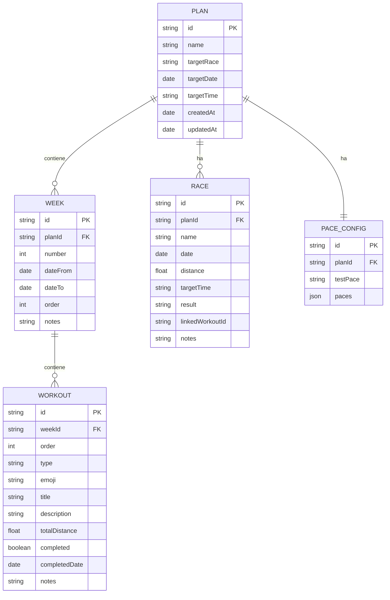

# 🗄️ Modello Dati — CalenRun42

> Schema del database IndexedDB con tutte le entità e relazioni.

---

## Diagramma Entità-Relazioni



---

## Dettaglio Entità

### 1. Plan (Piano di Allenamento)

| Campo | Tipo | Obbligatorio | Descrizione |
|---|---|---|---|
| `id` | string | ✅ | UUID generato automaticamente |
| `name` | string | ✅ | Nome del piano (es. "Preparazione Maratona Bologna") |
| `targetRace` | string | ❌ | Nome della gara obiettivo |
| `targetDate` | date | ❌ | Data della gara obiettivo |
| `targetTime` | string | ❌ | Tempo obiettivo (es. "3:20:00") |
| `createdAt` | date | ✅ | Data creazione |
| `updatedAt` | date | ✅ | Data ultima modifica |

### 2. Week (Settimana)

| Campo | Tipo | Obbligatorio | Descrizione |
|---|---|---|---|
| `id` | string | ✅ | UUID |
| `planId` | string | ✅ | Riferimento al piano |
| `number` | int | ✅ | Numero settimana (1, 2, 3...) |
| `dateFrom` | date | ✅ | Data inizio settimana |
| `dateTo` | date | ✅ | Data fine settimana |
| `order` | int | ✅ | Ordinamento per drag-and-drop |
| `notes` | string | ❌ | Note libere |

### 3. Workout (Allenamento)

| Campo | Tipo | Obbligatorio | Descrizione |
|---|---|---|---|
| `id` | string | ✅ | UUID |
| `weekId` | string | ✅ | Riferimento alla settimana |
| `order` | int | ✅ | Posizione nell'elenco (per drag-and-drop) |
| `type` | string | ✅ | Tipo (vedi tabella tipi sotto) |
| `emoji` | string | ❌ | Emoji indicatore visivo |
| `title` | string | ✅ | Titolo breve (es. "Scarico", "Lungo 30 km") |
| `description` | string | ❌ | Formula strutturata (es. "3 km RD + 7 km RL") |
| `totalDistance` | float | ❌ | Km totali |
| `completed` | boolean | ✅ | Completato sì/no (default: false) |
| `completedDate` | date | ❌ | Data di completamento |
| `notes` | string | ❌ | Note libere |

#### Tipi di Attività

**Running** (con supporto formula/ritmi):

| Tipo | Emoji | Descrizione |
|---|---|---|
| `scarico` | 🟢 | Corsa leggera di recupero |
| `qualita` | 🔥 | Lavoro di qualità (ripetute, fartlek...) |
| `mantenimento` | 🔵 | Corsa di mantenimento con allunghi |
| `lungo` | 🏃 | Corsa lunga (il cuore della preparazione maratona) |
| `gara` | 🏆 | Gara inserita nel piano |
| `riposo` | 😴 | Giorno di riposo |

**Extra-running** (solo titolo, senza dettagli strutturati):

| Tipo | Emoji | Descrizione |
|---|---|---|
| `palestra` | 🏋️ | Sessione di palestra |
| `arbitraggio` | ⚽ | Designazione arbitrale |
| `altro` | 📌 | Attività generica |

> **Nota**: La lista è espandibile. I tipi extra-running non hanno formula/ritmi, solo titolo + note opzionali.

### 4. Race (Gara)

| Campo | Tipo | Obbligatorio | Descrizione |
|---|---|---|---|
| `id` | string | ✅ | UUID |
| `planId` | string | ✅ | Riferimento al piano |
| `name` | string | ✅ | Nome della gara |
| `date` | date | ✅ | Data della gara |
| `distance` | float | ✅ | Distanza in km |
| `targetTime` | string | ❌ | Obiettivo di tempo |
| `result` | string | ❌ | Risultato effettivo (compilato dopo la gara) |
| `linkedWorkoutId` | string | ❌ | ID dell'allenamento che la gara sostituisce |
| `notes` | string | ❌ | Note libere |

### 5. PaceConfig (Configurazione Ritmi)

| Campo | Tipo | Obbligatorio | Descrizione |
|---|---|---|---|
| `id` | string | ✅ | UUID |
| `planId` | string | ✅ | Riferimento al piano |
| `testPace` | string | ❌ | Ritmo del test base (es. "4:30") |
| `paces` | JSON array | ✅ | Array di oggetti ritmo |

#### Struttura di un oggetto ritmo in `paces`:

```json
{
  "code": "RG",
  "name": "Ritmo Gara",
  "offsetMinSec": 10,
  "offsetMaxSec": 20,
  "paceMin": "4:40",
  "paceMax": "4:50",
  "color": "#FF6B35",
  "order": 1
}
```

---

## IndexedDB — Object Stores

```javascript
// Creazione database
const db = await openDB('CalenRun42', 1, {
  upgrade(db) {
    // Plans
    const planStore = db.createObjectStore('plans', { keyPath: 'id' });

    // Weeks
    const weekStore = db.createObjectStore('weeks', { keyPath: 'id' });
    weekStore.createIndex('byPlan', 'planId');
    weekStore.createIndex('byOrder', ['planId', 'order']);

    // Workouts
    const workoutStore = db.createObjectStore('workouts', { keyPath: 'id' });
    workoutStore.createIndex('byWeek', 'weekId');
    workoutStore.createIndex('byOrder', ['weekId', 'order']);

    // Races
    const raceStore = db.createObjectStore('races', { keyPath: 'id' });
    raceStore.createIndex('byPlan', 'planId');

    // Pace Configs
    const paceStore = db.createObjectStore('paceConfigs', { keyPath: 'id' });
    paceStore.createIndex('byPlan', 'planId');
  }
});
```
